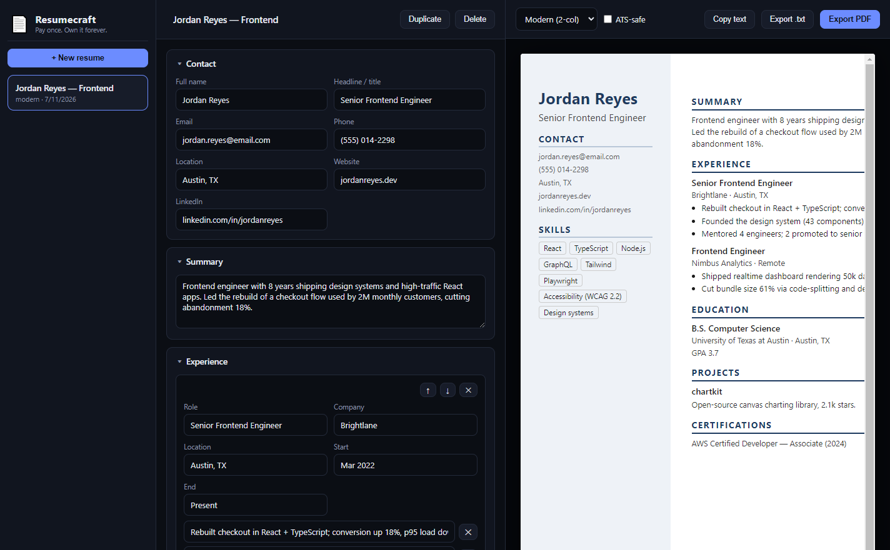

# 📄 Resumecraft

[](LICENSE)

**The resume builder you buy once and own forever.** Pick one of 7 templates, fill structured sections with a live preview beside you, flip on ATS-safe mode, and export a real PDF — 100% local, zero subscription, zero cloud, zero telemetry.

Zety charges **$23.70/month, forever**, to let you fill out a form and download the PDF of your own resume. Resumecraft is **$19 once**. Your job hunt is not a subscription.



## ☕ Skip the setup — get the 1-click installer

Don't want to touch a terminal? Grab the packaged Windows installer (and support development):

**→ [Get Resumecraft on Whop](https://whop.com/onetime-suite)** — pay once, own it forever.

## Features

- 🎨 **7 bundled templates** — Classic, Modern (2-col), Minimal, Executive, Compact, Tech (2-col), Elegant — swap templates any time without losing a word of your data
- 🤖 **ATS-safe mode** — one toggle strips columns, colors, and decorative styling into a plain single-column layout that applicant tracking systems parse cleanly; your content is untouched
- 📋 **Plain-text ATS-portal export** — export (or copy straight to clipboard) a clean text version for pasting into Workday/Greenhouse-style job portal forms
- 🖨️ **Real PDF export** — headless Chromium print (Electron `printToPDF`), US Letter, with a live **one-page overflow warning** in the preview so you know before you export
- ✍️ **Structured sections** — contact, summary, experience (bullet points with reorder controls), education, skills, projects, and unlimited custom sections (certifications, awards, languages…)
- 👀 **Live preview** — the exact export HTML renders beside the form as you type, debounced and instant
- 🗂️ **Versions & duplicates** — keep multiple resumes, duplicate one per job application and tailor it, rename/delete freely
- 🔒 **Local-first storage** — everything lives in a human-readable JSON file on your machine; no account, no cloud, no network calls
- 🛡️ **Safe rendering** — all user data is HTML-escaped before templating; script injection in a form field stays text
- 🌑 Premium dark UI, fast and framework-free

## Quick start

```bash
git clone https://github.com/bensblueprints/resumecraft
cd resumecraft
npm i
npm start
```

Run the tests (template rendering for all 7 templates, ATS-safe stripping, HTML escaping, plain-text export, store CRUD on real files, and a real Electron `printToPDF` export validated by PDF magic bytes):

```bash
npm test
```

Build the Windows installer:

```bash
npm run dist
```

## Resumecraft vs Zety

| | **Resumecraft** | Zety |
|---|---|---|
| Price | **$19 once** | $23.70/mo ($284.40/yr) |
| Cost after 1 year | **$19** | $284.40 |
| Cost after 3 years | **$19** (44x cheaper) | $853.20 |
| Your resume lives | **On your machine** | Their cloud |
| Works offline | **Always** | No |
| Account required | **No** | Yes |
| Download your own PDF | **Always** | Paid tier only |
| ATS-safe mode | **One toggle** | Template-dependent |
| Plain-text portal export | **Yes** | No |
| Unlimited versions | **Yes** | Tier-limited |
| Telemetry | **None** | Analytics + upsell emails |
| Source code | **MIT, right here** | Closed |

**Pays for itself in under 1 month** of Zety — and every month after that is pure savings.

## Tech stack

- **Electron** — main + preload (context-isolated) + plain HTML/CSS/JS renderer. No framework, no build step.
- **Pure render engine** (`lib/render.js`) — zero dependencies, all 7 templates + ATS-safe CSS + plain-text export in one module; runs identically in the main process and under Node for tests.
- **JSON store** (`lib/store.js`) — atomic writes (temp file + rename), corrupt-file recovery, one file per profile in Electron `userData`.
- **PDF export** — hidden BrowserWindow + `printToPDF` (US Letter, backgrounds on), so the export is pixel-identical to the preview.
- **electron-builder** — Windows NSIS installer.

## Data & privacy

Everything stays on your machine. Resumecraft makes **no network calls at all**. Your resumes are stored in a human-readable `resumes.json` under your OS app-data folder — export it, version it, back it up yourself.

## License

[MIT](LICENSE) © 2026 Ben (bensblueprints)
